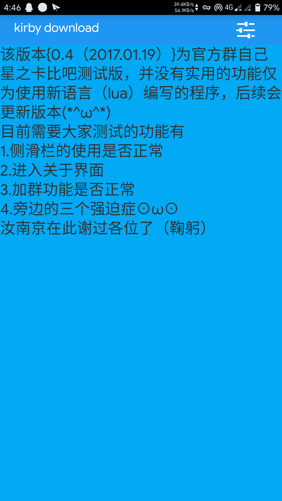
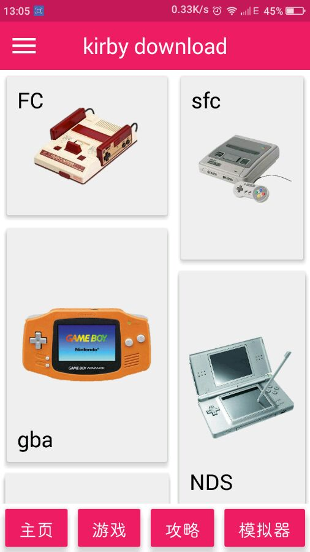
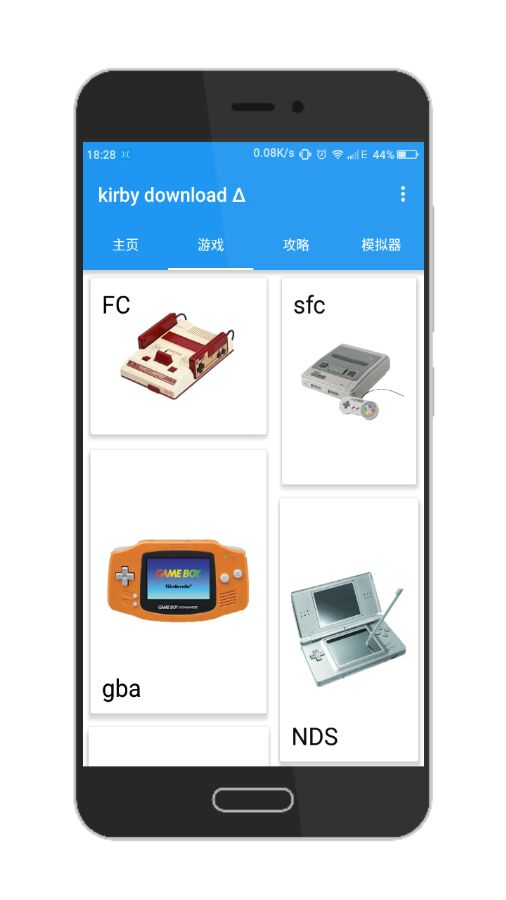
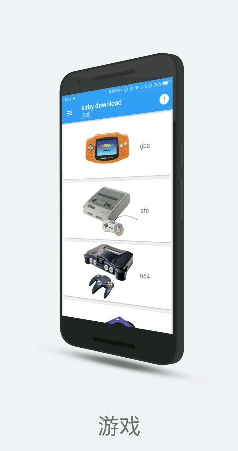
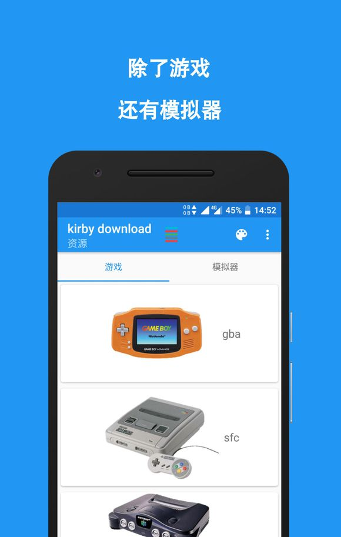
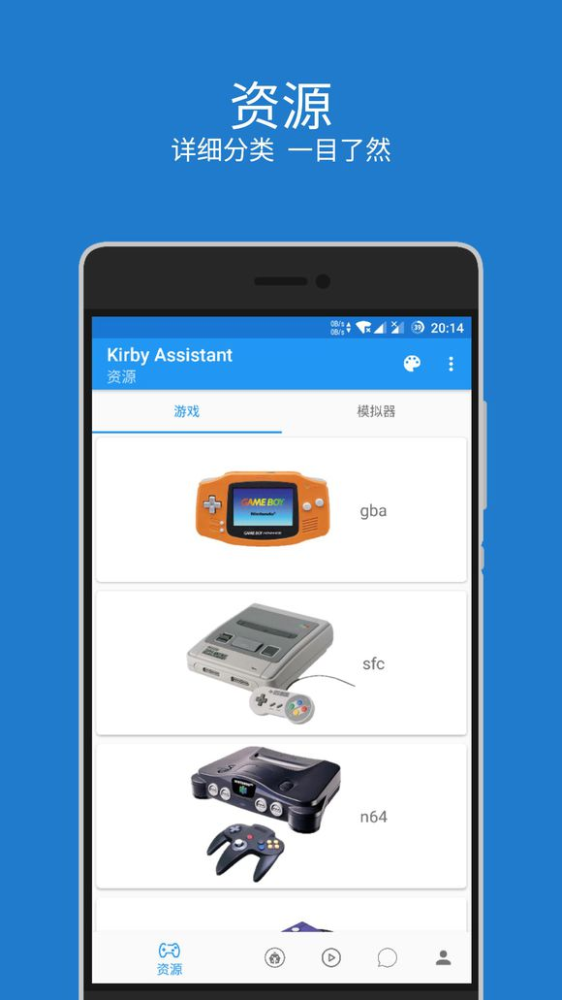

> 写在前面：
> 由于很多东西已经无法考证~~其实就是懒，当初没记下来~~，所以早期的版本可能会有记不清版本号的情况，不过大概还是能对的上时间的。

## 开局一段话，内容全靠编

大家好，众所~~不那么~~周知 Kirby Assistant 是一款可以下载星之卡比系列游戏的软件，第一个有意义的版本诞生于 2017 年 1 月 15 日 ~~我钦定的~~。那这过去的时间里究竟发过什么有趣的事？或者说是怎么发展的？那接着往下看吧！**电脑用户可以用过左边的栏目快速定位，手机用户，对不住啦**

## 源自想法

任何应用的诞生都应当有一些这样那样的理由，Kirby Assistant 也不例外。老用户可能知道这款程序最早的名字是 Kirby Download 的，那他又是怎么诞生的呢？这还要从 [wwylele](https://github.com/wwylele) 说起。当时他在 星之卡比吧 里编写一款可以编辑 星之卡比:梦之泉物语 DX 的地图编辑器，其中一楼发的图中背景是 IDE，里面的是编辑器源码，前景是编辑器本体，然后楼中楼里有人说「看源码」之类的话。当时我内心就：EXM？还有这种操作吗？太炫酷了，这就算是我想学习编程的起源了。

再后来就是接手吧盘的事了，具体时间已经无从考证，因为 wwylele 已经删除了原贴，但是根据 [为啥置顶的资源被删了](https://tieba.baidu.com/p/4878419837) 这帖的发布时间 `2016-11-27` ，以及我发的 [发布，肯德基豪华午餐（雾 kirby download 发布](https://tieba.baidu.com/p/4850329936) `2016-11-05` 以及 [我个人看法！？以及水一帖！？](https://tieba.baidu.com/p/4881013343) `2016-11-29` 这两贴的时间来看，最早在 2016-11-05 时我已经接手了贴吧并且有了 Kirby Download 初代版本，所以姑且推算在 `2016-11` 前我接手了吧盘吧。

那接手了，可不能只是简单的吧资源放在我名下就完事了。如果有的人嫌访问吧盘麻烦怎么办？如果有的人不能迅速找不到想要的资源怎么办？如果有的人记不住地址怎么办？~~亡命三连~~ 那可不得了，这得赶紧搞个东西出来方便一下。脑子里突然闪过当年种下的草，正好最近有看到 iApp，这个可以快速编写程序，那就搞呗？

## 未发布的初代,绝唱 iApp

### 从零开坑

搞！说的轻巧，那得有好的构思啊。那怎么做？怎么设计？卡片？不行，效率太低，那就列表？诶，这个绝妙，可以快速定位。用之前下载的 iApp 教程就这样动手起来，十分简单，甚至不用动手编写，只需要拖动就可以了。这可让我第一次尝试就尝到了甜头，顺顺利利的就做了几个列表出来。

### 无力吐槽的图标

列表是有了，那图标？既然这是关于 `星之卡比` 的程序，那就用一张官方的图，后面再用 PS Touch 做一个背景上去，就是下面这个

什么?这也太丑了吧？你看这色彩，这布局，这裁剪，丑到家了。不过当时可没有人来帮我做设计，就现先这样用吧。

图标有了，凑合能用的程序也有了，那叫什么名字呢？这是关于 星之卡比 的程序，可以用来下资源，你可能认为理所当然的叫 卡比下载器？不不不，根据 [母语羞涩原理](https://www.zhihu.com/question/308116322) 当然是叫 Kirby Download 啦！

### 这就算开始了吧

然后我就带着这个样子的程序去贴吧发帖了~~当然因为傻逼百度这贴已经找不到了~~
~~对了，图标我换了，长这样~~

而且当时还做了个 [视频](https://www.bilibili.com/video/av7053495) ~~辣眼睛注意~~

<iframe src="//player.bilibili.com/player.html?aid=7053495&cid=11499734&page=1" scrolling="no" border="0" frameborder="no" framespacing="0" allowfullscreen="true" style="width: 640px; height: 430px; max-width: 100%"> </iframe>

## 虽然不好用 但 你好 AndroLua 你好 Kirby Download

### 初识 AndroLua

时间一天天过着，初代版本也在不断更新~~虽然没更新多久~~。可是 iApp 只能拖动的布局已经不能满足我了，我需要更好用的语言，更好用的 ide。迫于当时觉得 Java 入门门槛过于高，正好 AndroLua 又在盛行，我也就选择使用这个来接着编写了。这是一个由 nirenr 一个人改编的，基于 Lua 语言，但是有一些 Java 语法成分的 [解释型语言](https://baike.baidu.com/item/%E8%A7%A3%E9%87%8A%E5%9E%8B%E8%AF%AD%E8%A8%80/8888952?fr=aladdin)。~~我估计就是因为太好用，太方便才会有人用的。不过成也方便，败也方便。（指弱类型）~~

### 崭新的 Kirby Download

那用了新的语言，怎么能不重新设计界面呢，首先就是界面大改~~当然这是测试版界面~~

新的图标，一定要极简，本文设计，质感设计都要有，于是就有了下面这样

这样，Kirby Download~~钦定的~~诞生日就有了 2019-1-15

### 完整的资源

因为还有学业，所以不能做到日更，所以在周更和双周更的情况下终于在 2017-03-25 收录了绝大部分资源，此时应用界面已经比较现代了~~并且傻逼一样的给应用名末尾加了个 β~~

可以说，这个主页列表界面基本上维持到 Lua 版本结束

并且在此之前使用了 fir 托管软件，地址：<https://fir.im/kirby>

### 跨越 版本 1.0

1.0 算是已经接近 Lua 版本的尾声了，此时发布了一个对今后影响十分巨大的主页界面

而且在此之前更换了新的图标，不过这个图标没有持续很久使用

但是这个版本 bug 居多，很多人反映无法使用，所以我很快迭代了

### 震惊 KD 惨遭被盗

哈哈哈这个应该是个人开发者必经的，总是会被二次打包的，不过我倒是没有特别在意，只是在贴吧发了 [这个帖子](https://tieba.baidu.com/p/5094724024) 而已

### 虚假的官网

在上面那些事情的某个期间，我去一个模板网站制作了一个 [官网](http://kirbydownload.mystrikingly.com/) ~~其实就是改改图片，改改文本而已~~

### 停止支持

不是停止 KD，而是停止版本支持，就在 2017-05-05 这一天发的 [kirby download Δ](https://tieba.baidu.com/p/5102809713) 中

## 你好 Java

### 为什么

其实 AndrodLua 挺好用的，那么我为什么要换呢？

> 扩展性

是的 AndrodLua 的扩展性十分糟糕，以至于很多新的特性无法使用，在这种情况下我毅然选择了 Java。

### 停更,但不是永远

在使用 Java 编写的时候我不得不停止更新 Lua 版本的 KD，不过没有持续很久。不得不说 Java 是安卓开发的主流，我遇到的很多问题都可以得到有效解决，这种前所未有的有效，让我在不到两个月的时间里就搞定了 Java 版本的开发。

### 手滑的重要性（雾

在 `2017-06-20` 这天发售了手滑~~铁卢~~事件，不过吧，这个时候我已经准备 Java 版本的开发了，所以丢失的 Lua 版本源码也无伤大碍~~个屁~~
参阅[咳咳，我告诉你们啊。。。](https://tieba.baidu.com/p/5174062697)

### 来了来了,他来了

`2017-08-14` 这天算是正式发布了 KD 的 Java 版吧，于是乎就有了[我又来炒冷饭了，虫 ♤ 人一口 虫 ♤ 人一口](https://tieba.baidu.com/p/5272051400) ~~标题暴力，暗示那位大人偷走了我停更的时间咳咳咳~~界面如下

同时这个图标也是从 Lua 版一直用到 Java 版

### V2？集合体？Slogan？2018？都是什么

#### 永不弃坑 就是我~~除非我亏的没钱了~~

[【绝不弃坑】【游戏资源看这里】kirby download](https://tieba.baidu.com/p/5351905548) 这个就是集合了一些链接，当时百度~~傻逼的~~审核机制还没有那么严格，这种帖子放现在肯定 gg

#### 不仅有游戏

是的，这是从那时确定下来的 slogan 现在看来确实如此

### 什么什么？用户系统？闲聊？模拟器直接下载吗

`2017-8-23` 也就是 Java 版本发布后，更新了一个让我亏钱至今，甚至濒临几次倒闭的东西，用户系统与文件服务。
确实很好用，比看评论区方便多了。就是……不能回复，至今也不行~~好尴尬啊~~

### 3.0 预告

#### 真实手绘

手绘预告，见过没？[【技术】kirby download3.0 预告](https://tieba.baidu.com/p/5519636217)就是这么秀，纯手绘，画出 3.0 的大部分想法~~原稿已丢失~~

#### 除夕夜发布

此时 KD 界面已经是很接近现在的了，具体如图

以及，真就除夕夜发布~~正好一周年，蛮有意义的~~
[【预热】kirby download3.0，除夕夜发布！！](https://tieba.baidu.com/p/5551002824)
[【深夜更新】kirby download3.0](https://tieba.baidu.com/p/5552664544)

> 啊，大家好啊
> 这里炎忍，经过两个月的开发，迎来了 3.0 版本，接下来是更新日志:
> duang~
> 深夜更新 1.新的图标，新的宣传图 2.新的菜单 3.攻略视频添加 4.稳定服务器 5.闲聊优化 6.全局滑动返回 7.优化捐赠 8.优化翻译，修复错误翻译 9.修改整体算法 10.重新设计启动界面 11.针对于安卓 7.1.2 进行优化 12.针对于虚拟按键进行优化 13.针对于安卓 4.4.4 进行优化 14.压缩体积，提升性能 15.进一步优化用户算法
> .......
> 更多优化，更新，请进入 app 感受吧！！

以上的当时的更新日志，也是发帖内容。

## 再见 Kirby Download

### 事件

3.0 更新两天后，由于一些现在不方便描述的的原因~~因为是 QQ 上发生的事~~，所以不多做描述。大概就是我被喷了，还是圈内人，然后我又玩玻璃心~~说实话真的受不住~~，就这么僵持了几天，我下架了 Kirby Assistant。
`2019-2-25` 我进行了 [Kirby Assistant 仓库](https://github.com/EndureBlaze/kirbydownload/) 的最后一次提交，Commit 信息是 「再见 Kirby download」，这个仓库的 commits 也定格在 53，不再更新

### 反思

这个事情过后我也反思自己，也确实做的不够好，如果做的很好，就不会引来别人的这种说法，这么想着，我在 QQ 空间发了如下说说

也算是预告吧

## 崭新的 你好 Kirby Assistant

### 从头来过

`2019-2-27` 我在贴吧发帖[【资源】Kirby Assistant](https://tieba.baidu.com/p/5568861528),这个界面基本定格至今了

### 新的特性

感谢 AIDE 的更新，让我可以用到诸如自适应图标的新特性，并且在 0.4-beta-1 成功完美适配 AndroidP 这也是截止发文为止最新的 Android 正式版

### 撇弃旧框架

分别在 0.4-beta-3 、0.4-beta-6 和 0.4 版中撇弃了旧版本的条条框框，这也是成长最快的时期

### 新的图标

这是分别在 0.4-beta1

和 0.4-beta2

的图标，直到目前我也是最喜欢的两个，后面做成了双图标模式

## 未来·炫动

现在，撇弃百度贴吧与 QQ，舞台交给 GitHub

### 全新的 KA

2018-12-9 我推出了全新版本的 KA ——未来·炫动，这个版本拥有诸多特性，完整的 AndroidP API，完整的自适应图标，双镜像仓库，以及最重要的新服务器结构~~虽然后面还让我丢数据了~~
如果说 0.4 大版本是 KA 发展最快的时期，那未来·炫动一定是我最推荐的版本

### 更新

1.2.6（Build 29）引入的更新一定是最刚需的，往往程序更新了却不知道，这次，他来了，引入 Build 比较概念，让你随时都能用上新版本

### 全新架构 PBL

如果说更新是刚需，让你享受新特性，那么 1.2.1（Build 24） 引入的全新服务器架构和 PBL 一定是更稳定的前提。前者拥有更快的响应速度，后者不会对用户有任何影响，但是会让我维护更方便~~这不是你丢失服务器数据的理由~~

### 无延迟启动

1.2（Build 23）引入的全新启动模式，根据 AndroidP API 编写，适配新特性，毫秒级启动速度

### 全新网站

这不是程序更新的范畴，但是息息相关
`2019-2-15` 这天我买了域名<https://endureblaze.cn>并且把 Kirby Assistant 的官网定为<https://ka.endureblaze.cn>

### 更全新的图标

在 1.2.7 版本我合并了两个图标并且 hk 流星 进行了微调

这也是到目前为止一直使用的图标

### AndroidX，MD2，以及更小的体积

我购买了电脑，这让我可以跟方便的编写程序，更是把 Kirby Assistant 的体积压缩到更小

## 炫动了，未来呢

我想，我会一直保持不定期更新，这个程序我暂时不可能放弃的，即使再亏钱

## 未完待续

革命尚未完成，同志仍需努力

### 我还想说

Kirby Assistant 发展两年多来，实数不易，这让我也了解到生活的不易。是啊，谁都不好过，所以，希望以后还能多多下载，推荐给你身边玩星之卡比的人，或者，带 Ta 入坑

## 感谢名单

> 这是在 Kirby Assistant 发展道路上帮助过我的人，如果有疏漏，请联系我补充

**排名无先后之分**
点击名字可以跳转链接(如果有)

- **感谢在这个过程中所有给予我鼓励的人**
- **感谢每一个捐赠者**
- 感谢[**longxk2017**](https://github.com/longxk2017)(GithHub)进行**繁体中文翻译**
- 感谢[**hk 流星**](https://www.coolapk.com/u/555883)(酷安)进行**图标绘制**
- 感谢[**Markuss**](https://www.coolapk.com/u/529718)(酷安)进行**图标绘制**
- 感谢[**光之耀西**](http://tieba.baidu.com/home/main?un=%E5%85%89%E4%B9%8B%E8%80%80%E8%A5%BF)(百度贴吧)进行**英文翻译**
- 感谢[**难难难 550**](http://tieba.baidu.com/home/main?un=%E9%9A%BE%E9%9A%BE%E9%9A%BE550)(百度贴吧)进行**英文翻译**
- 感谢[**蝙蝠侠骑摩托车**](http://tieba.baidu.com/home/main?un=%E8%9D%99%E8%9D%A0%E4%BE%A0%E9%AA%91%E6%91%A9%E6%89%98)(百度贴吧)的**资源投放**
- 感谢[**★☆ 小伊布 ☆★**](http://tieba.baidu.com/home/main?un=%E2%98%85%E2%98%86%E5%B0%8F%E4%BC%8A%E5%B8%83%E2%98%86%E2%98%85)(百度贴吧)进行**图标绘制**
- 感谢[**邵旭东**](http://www.shaoxudong.com)(个人主页)提供的**备案域名**
- 感谢[**lxfly2000**](https://github.com/lxfly2000)(GitHub)进行的**程序协助**
- 感谢[**塔林狐**](https://www.coolapk.com/u/1157774)(酷安)进行**编写 FAQ**
- 感谢[**虚影无华**](https://space.bilibili.com.13001252)(哔哩哔哩动画)制作的 **星之卡比 100%计划** 系列视频
- 感谢[**梦想卡比**](http://tieba.baidu.com/home/main?un=%E6%A2%A6%E6%83%B3%E5%8D%A1%E6%AF%94)(百度贴吧)进行**早期版本测试**
- 感谢[**oxsm9**](http://tieba.baidu.com/home/main?un=osxm9)(百度贴吧)的 **红米 2A**
- 感谢更多我应该感谢但记不住名字及人以及**感谢我的父母**
