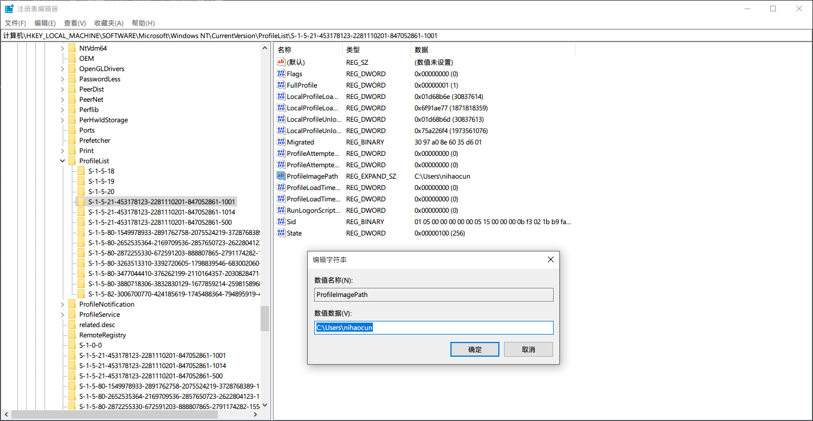


修改注册表有风险，操作需谨慎，注意备份重要文件


由于 Windows 10 的奇葩机制本地账户名是在线账户邮箱的前五位，导致我登录在线账户之后在本地显示的名称以及文件夹从我名字全拼的 `nihaocun` 变成了 `nihao`，虽然能忍，但是越看越不顺眼，就开始在网上找修改的方法。然而搜到的结果也大多不完整，好在还是能拼起来的，现在终于是改成功了。


以下操作在 你的个人账户 完成


## 开启 Administrator 账户

我们需要开启这个账户去修改注册表和文件夹名，家庭版用户请先升级到专业版，专业版用户打开
`控制面板` -> `系统和安全` -> `管理工具` -> `计算机管理`，然后按图所示依次打开
`本地用户和组` -> `用户` -> `Administrator`，然后去掉 `账户已禁用` 前面的复选框即可。

## 修改用户名

接着不关闭计算机管理，找到你需要修改的用户名，然后右键重命名即可，注意这里不能和计算机名重复（大小写不敏感）


以下操作在 Administrator 完成


## 修改注册表

注销当前账户切换到 Administrator，按下 `Win + R` 打开命令窗口，输入 `regedit` 回车运行打开注册表编辑器。使用 `Ctrl + F` 搜索 `ProfileList` 或者手动定位到 `HKEY_LOCAL_MACHINE\SOFTWARE\Microsoft\WindowsNT\CurrentVersion\ProfileList` 这一项。在这里有很多 `S-1-5` 开头的项，依次检查会有一个 `ProfileListPath` 为 `C:\User\<你的用户名>` 这一项，双击修改即可。

## 修改文件夹名

在文件管理器找到 `C:\User\<你的用户名>` 然后直接修改即可。


以下操作在 你的个人账户 完成


## 创建联接

现在回到原来的账户发现名字已经改了，而且原来的数据还在，不过部分环境变量以及应用配置可能会出问题，这里提供两个方法：

- 一个一个修改路径保证不出错
- 创建一个联接
  > 用管理员权限运行一个 CMD 窗口，然后输入 `MKLINK /J C:\Users\<旧用户名> C:\Users\<新用户名>`，这样不论访问 `C:\Users\<旧用户名>` 还是 `C:\Users\<新用户名>` 都会定位到 `C:\Users\<新用户名>`。出现下图这样就是成功了。
  > 
