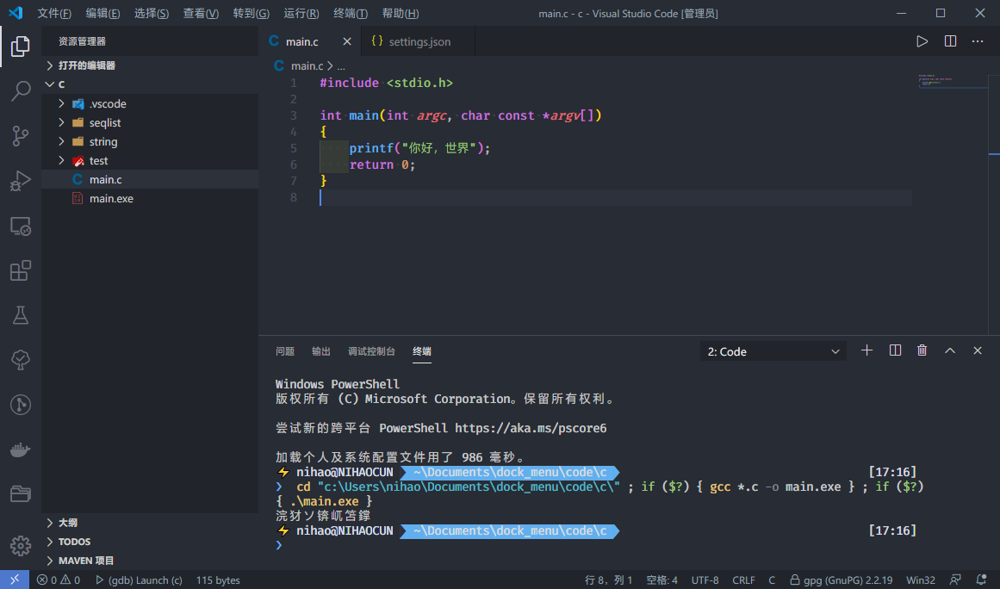
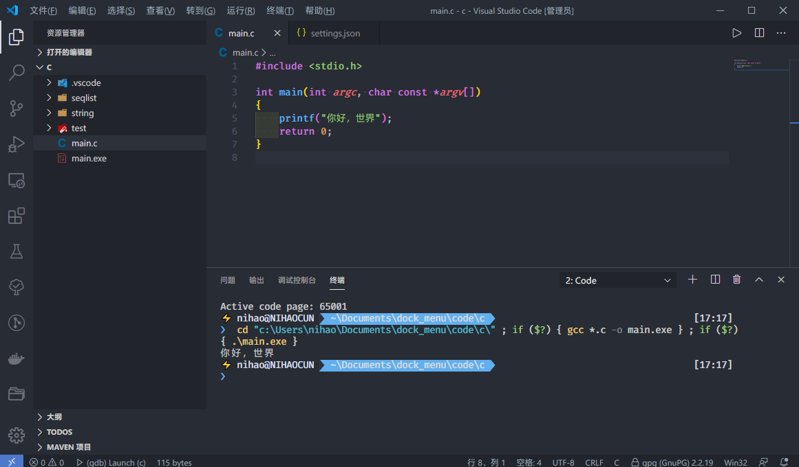
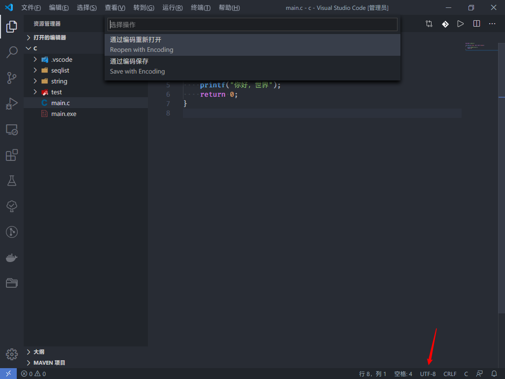

在 Windows 下使用 VSCode 编译运行 C/C++，都出现中文乱码的问题，这是由于 Windows 控制台使用的还是 GBK 编码。我在网上搜了一下发现需要更换编译器解决，这里贴一下 [梧矜](http://blog.00oo00.xyz/) 的 [解决 vscode 编译运行 C 程序时乱码](https://blog.00oo00.xyz/2020/03/12/ru-he-jie-jue-vscode-bian-yi-yun-xing-c-cheng-xu-shi-shu-chu-zhong-wen-luan-ma/)。

不是这种方式不好，这种确实从根本解决了问题，但是我是实在懒，所以想了一些外门邪道。然后百度到了可以使用 `chcp 65001` 命令把控制台的编码切换到 UTF-8，当然你可以参考这篇 [百度知道](https://jingyan.baidu.com/article/f7ff0bfcee2dc22e26bb13d5.html) 或者这篇 [博文](https://www.cnblogs.com/jpfss/p/11016870.html) 把编码永久更改，但是我怕会出奇怪的问题，所以在 VS Code 的配置文件找了找，没想到还真有这种骚操作。


2020-12-14 更新新方法


其实只要给 code runner 插件、手动编译时、VS Code 调试时上 `-fexec-charset=GBK` 就好了，之前那种方法简直是绕弯路，交作业的时候只需要把编码改成 GBK 就好了。唯一的缺点就是不能编译 GBK 文件，不过这不是问题。

## 偷懒的方式

在 VS Code 中通过打开 `文件`-> `首选项`-> `设置`，然后编辑 VS Code 的 `setting.json` ，然后添加如下代码

```JSON
{
    "terminal.integrated.shellArgs.windows": [
        "-NoExit",
        "/c",
        "chcp 65001",
    ]
}
```

然后保存即可，现在编译就不会出现中文乱码的问题了，这里贴一下图





### 缺点

当然缺点也是有的，就是每次编译的时候会在顶部显示一个 `Active code page: 65001`，不过我觉得无伤大雅，毕竟没换编译器就可以实现差不多的效果还想怎么样。~~主要还是懒~~

## 简便的方式

~~其实也可以通过这个按钮解决，不过这个是改变文件的编码，如果把这个文件放到其他设备上可能会有问题~~



## 工作区

如果你只需要在这个工作区生效的话只需要这个目录下的 `.vscode` 文件夹里的 `setting.json` 添加这个配置就好了，这样只会对这个工作区生效。

## 更多

有关 `chcp` 的更多描述

> 65001 UTF-8 代码页
> 950 繁体中文
> 936 简体中文默认的 GBK
> 437 MS-DOS 美国英语
