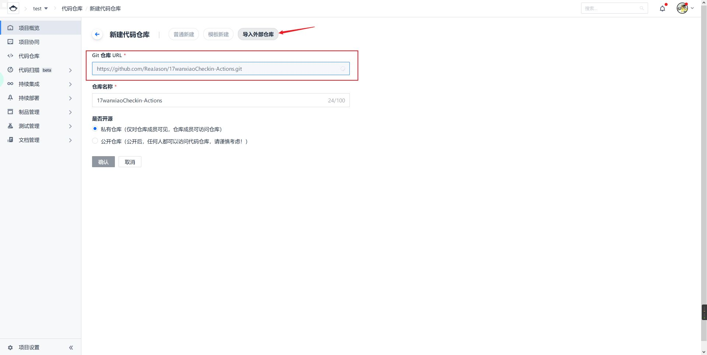
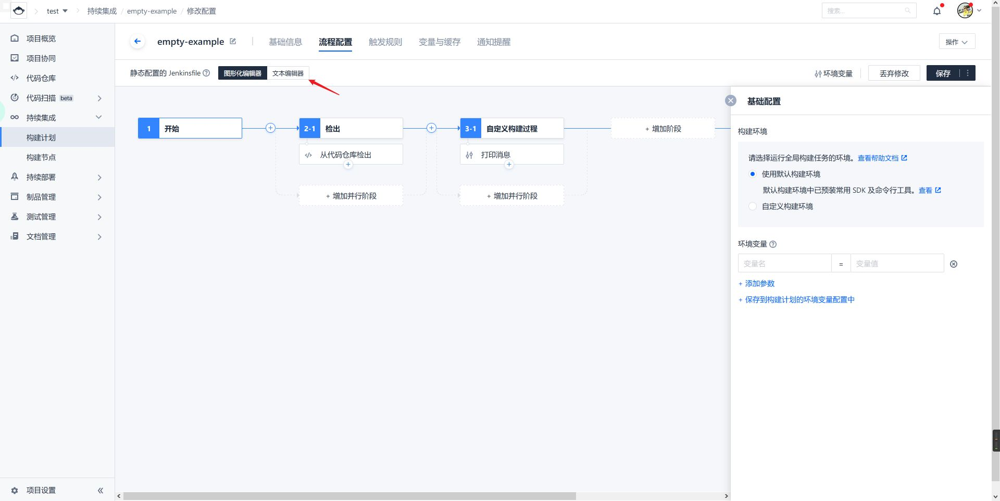


感谢 [ReaJason](https://github.com/ReaJason) 大佬的 [仓库](https://github.com/ReaJason/17wanxiaoCheckin-Actions)


由于一些未知的原因，没法在 GitHub Action 上使用 <https://github.com/ReaJason/17wanxiaoCheckin-Actions> 进行打卡了，本地部署还不如手动打，买服务器又太贵了，我就想能不能在 Coding 上来进行部署。

## 创建项目和仓库

首先你要有个 Coding 账号，然后登陆进去，选择 `项目`->`创建项目`，选择第一项

名称和标识随意填写，这里填写 test。创建之后点击 `代码仓库`，选择 `新建代码仓库`


## 构建持续部署

选择 `导入外部仓库`，然后在 `Git 仓库 URL` 这一项填入 `https://github.com/ReaJason/17wanxiaoCheckin-Actions.git` 点击确认就可以导入了。

随后点击 `持续部署`->`构建节点`，选择 `创建构建计划`，然后拉到最下面选择 `自定义构建过程`


这里不用做更改，直接确定就好了

点击切换到文本编辑器

然后使用下面的内容替换进去

```shell
pipeline {
  agent {
    docker {
      reuseNode true
      registryUrl 'https://coding-public-docker.pkg.coding.net'
      image 'public/docker/python:3.7'
    }

  }
  stages {
    stage('检出') {
      steps {
        checkout([
          $class: 'GitSCM',
          branches: [[name: GIT_BUILD_REF]],
          userRemoteConfigs: [[
            url: GIT_REPO_URL,
            credentialsId: CREDENTIALS_ID
          ]]])
        }
      }
      stage('构建') {
        steps {
          archiveArtifacts(artifacts: 'README.md', fingerprint: true)
          echo '部署环境'
          sh 'pip3 install requests pycryptodome'
          sh 'pip3 install pycryptodome'
          echo '开始签到'
          sh '''python3.7 index.py <<EOF
${USERNAME}
${PASSWORD}
${SCKEY}
EOF'''
        }
      }
    }
  }
```


切记在 `代码仓库`->`设置`->`同步信息` 去掉勾选 `开启自动同步` 然后保存，以免签到失效。


## 后续设置

点击上面的保存后选择触发规则，点击定时触发这里添加一个规则


然后点击 `变量与缓存`，新建三个环境变量


`SCKEY`——Server 酱的 SCKEY
`USERNAME`——完美校园的登录账号
`PASSWORD`——完美校园的登录面

如果要多人打卡请参考 [原文档](https://github.com/ReaJason/17wanxiaoCheckin-Actions)

最后返回选择立即构建就可以测试了，成功的话微信会有推送


## 推送打卡结果到 QQ

打开 Qmsg酱的 [官网](https://qmsg.zendee.cn/)，根据网站的指引登录账号等操作

>1.[登录](https://qmsg.zendee.cn/me.html)Qmsg网站。  
>2.选择「Qmsg酱」小姐姐（有多个「Qmsg酱」小姐姐供您选择哦）。  
>3.添加需要接收消息的QQ号（每个QQ号都需要添加您选择的「Qmsg酱」为QQ好友）。  
>4.调用接口（[查看接口文档](https://qmsg.zendee.cn/api.html)）发送GET或POST请求，就能在QQ里收到「Qmsg酱」给你发的消息。  

一定要记得添加 Qmsg酱好友！

打开控制台在 `KEY` 这里复制你的 key


然后返回仓库打开 `index.py` 这个文件，按下 `Ctrl + F` 搜索 `desp` 替换为 `msg`，如图所示

最后把 316 行的 `send_url = f"https://sc.ftqq.com/{sckey}.send"` 改为 `send_url = f"https://qmsg.zendee.cn/send/{sckey}"` 就好了，记得修改环境变量的 `SCKEY`，快去运行测试一下吧。


322 行的 `for _ in range(3):` 改为 `for _ in range(1):` 可以避免多次推送，可能有未知问题。

