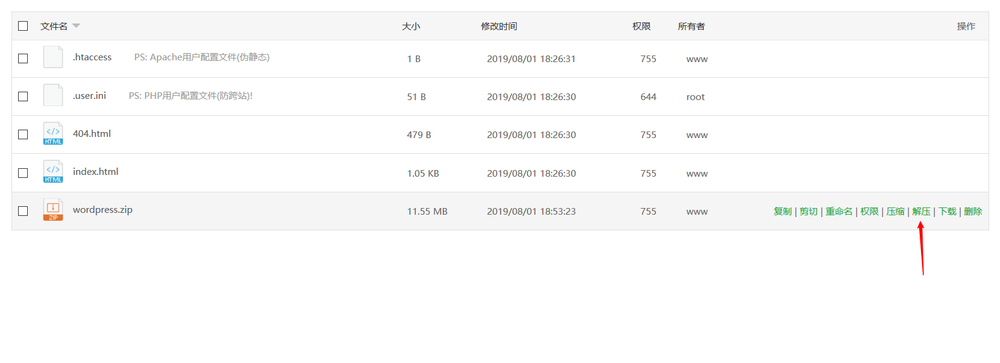

WordPress 可能是比较好用的博客系统了，当然改一下做个非博客应该也可以。当然是需要服务器的，想我这种用 Hexo 配合 GitHub Page 当然是用不起的了，不过前段时间帮朋友搞了一下，就在这里记录一下过程了

## 准备

### 选择服务器

首先服务器用的是阿里云的轻量应用服务器，因为比较便宜，[点击这里](https://common-buy.aliyun.com/?commodityCode=swas&regionId=cn-hongkong&userCode=3xwlzuab#/buy)可以查看价格和配置。当然这里就不测试了，因为价格在这里摆着，还要什么自行车。

### 下载 WordPress 文件

访问<https://cn.wordpress.org/download/>
然后点击

下载到你能方便找到的地方就好了

## 系统和面板

然后我选择的是 CentOS 然后装的宝塔面板，[点击查看](https://bt.cn/)宝塔的面板，免费版也够用

## SSH到服务器

### 开启端口

看这个页面即可<https://www.bt.cn/bbs/thread-19376-1-1.html>

推荐打开所有端口，因为宝塔面板也有防火墙

### SSH 配置

首先要到轻量应用服务器的[控制面板](https://swas.console.aliyun.com)然后点击你的服务器


点进去后再转到远程连接


选择这里任何一种都可以，没有任何影响


那么我这里是用的第三种，也就是用账号密码来连接。

### SSH 客户端

因为用账号密码的话，是要用本地客户端连接的，那么这里推荐使用[FinalShell(http://www.hostbuf.com/t/988.html)来连接，国人制作，有免费版本，中文界面，支持 Windows,macOS,Linux
点金网址后选择你系统对应的链接就可以下载了


下载安装后打开就可以看到界面了

然后点击这个按钮


然后点击


就可以添加一个连接了

在这里输入服务器的名字，ip，用户名，密码，然后保存再双击刚才添加的就可以连接了


## 安装面板

安装很简单，一行命令就搞定了

``` shell
yum install -y wget && wget -O install.sh http://download.bt.cn/install/install_6.0.sh && sh install.sh
```

如果是 Ubuntu 用这个命令

``` shell
wget -O install.sh http://download.bt.cn/install/install-ubuntu_6.0.sh && sudo bash install.sh
```

Debian 系统的用这个

``` shell
wget -O install.sh http://download.bt.cn/install/install-ubuntu_6.0.sh && bash install.sh
```

Fedora 系统用这个

``` shell
wget -O install.sh http://download.bt.cn/install/install_6.0.sh && bash install.sh
```

怎么样，是不是很简单，后面都是自动化的安装了。当然我只使用过 CentOS，所以下面的还用 CentOS举例

安装完毕后会有一段提示，里面有访问面板的地址和默认的用户名还有密码，当然随后都可以改

## 登录面板

进入面板登录后会选择安装一些东西，这里推荐使用编译安装，虽然费时间但是很稳定。

现在，喝杯咖啡看看书，或者小睡一会儿，这个过程可能需要3-4个小时

## 解析域名

现在，你的面板应该已经部署好了，那下一步就是解析域名了，这里假设你已经完成了域名的更改，我使用的是腾讯云提供的解析服务演示，当然阿里云或者其他服务商也会有。
访问<https://console.cloud.tencent.com/cns>登录腾讯云配置解析

### 绑定域名

点击**添加域名**然后输入你的域名，比如输入 ljbaidu.com ~~当然这个要填你的域名，我只是吐槽一下百度~~然后点击确定就可以了

### 配置DNS

添加域名后如果**解析状态**提示异常的话就可能是 DNS 的问题，需要去注册商哪里讲 DNS 修改为

``` html
f1g1ns1.dnspod.net
f1g1ns2.dnspod.net
```

然后等待最多72小时就可以了

### 添加解析

看到这里说明你的 DNS 已经没问题了，现在点击操作栏的**解析**，进去之后点击上面的添加记录。**主机记录**选择 `@` 这一项就可以了，**记录类型**选择 `A` ，**记录值**填入你的服务器 `IP`

最后点击保存，稍作等待，这个过程需要十分钟才能生效~~当然如果你是氪金用户当我没说~~

## 正式开始部署 WordPress

### 添加站点

现在登录你的宝塔面板，在侧边栏找到**网站**，点击后选择**添加站点**

然后这样填


~~再次声明，ljbaidu.com只是调侃，请填写自己的域名~~

然后点击**提交**

### 添加数据库

然后选择侧边栏的**数据库**，然后选择**添加数据库**
填写数据库名称，用户名和密码，选择访问权限然后选择提交，如图(注意看箭头所指的选项)


### 修改 WordPress 配置

解压刚开始下载的 wordpress-5.2.2.zip ，然后解压到一个文件夹中。
找到 wp-config-sample.php 并重命名为 wp-config.php ，然后使用文本编辑器或其他打开 wp-config.php。
找到

``` php
// ** MySQL settings - You can get this info from your web host ** //
/** The name of the database for WordPress */
define( 'DB_NAME', 'database_name_here' );

/** MySQL database username */
define( 'DB_USER', 'username_here' );

/** MySQL database password */
define( 'DB_PASSWORD', 'password_here' );

/** MySQL hostname */
define( 'DB_HOST', 'localhost' );

/** Database Charset to use in creating database tables. */
define( 'DB_CHARSET', 'utf8' );

/** The Database Collate type. Don't change this if in doubt. */
define( 'DB_COLLATE', '' );
```

修改为

``` php
// ** MySQL settings - You can get this info from your web host ** //
/** The name of the database for WordPress */
define( 'DB_NAME', 'wordpress' );//这里填入刚才创建数据库时数据库名称

/** MySQL database username */
define( 'DB_USER', 'wordpress' );//这里填入刚才创建数据库时的用户名

/** MySQL database password */
define( 'DB_PASSWORD', 'password' );//这里填入刚才创建数据库时的密码

/** MySQL hostname */
define( 'DB_HOST', 'localhost' );//这个和下面三个不做修改

/** Database Charset to use in creating database tables. */
define( 'DB_CHARSET', 'utf8' );

/** The Database Collate type. Don't change this if in doubt. */
define( 'DB_COLLATE', '' );
```

保存文件并退出

返回上一目录，压缩这个文件夹


### 上传 WordPress

打开宝塔面板，选择网站

点击根目录那一栏下面的文字，也就是


然后选择**上传**，再点击**选择文件**，然后找到刚才打包的文件


点击**开始上传**，等待即可

### 解压

点击这个选项，然后直接确定即可解压


现在访问 你的域名/wp-admin/install.php 就可以开始安装了，比如 <http://ljbaidu.com/wp-admin/install.php> ~~再次，我没有这个域名，所以下来用我的域名做演示~~

访问之后可以看到这个界面


根据图上的注释填写，然后点击就可以安装了

在这里点击Log In


在下一个页面登录即可

## 结束

至此，所有安装过程已经完成，现在就可以开始使用了

如果在安装过程中有什么问题可以通过博客主页的联系方式联系我，或者在下面留下你的评论
