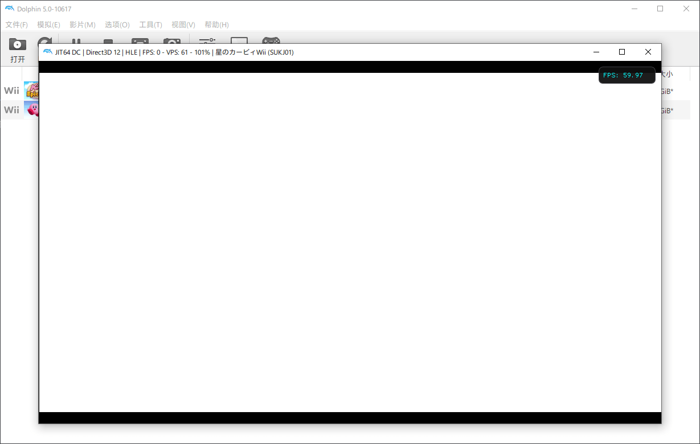
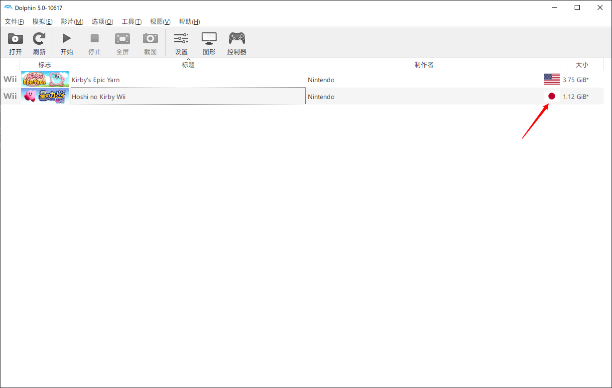
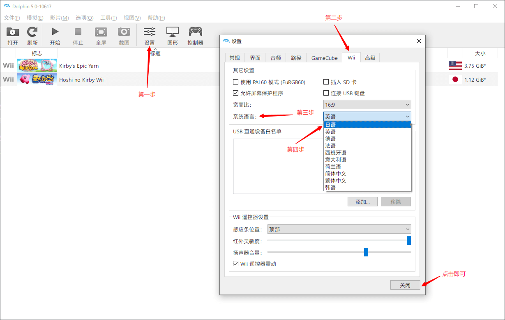
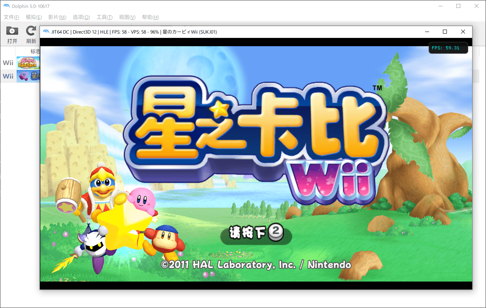
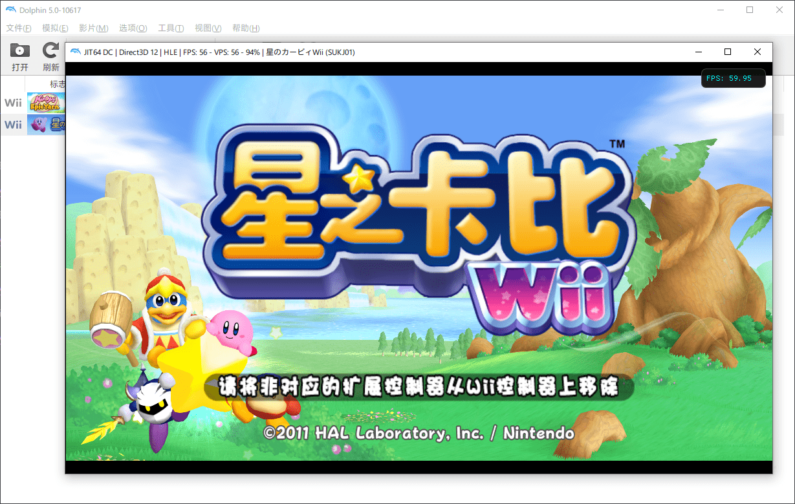
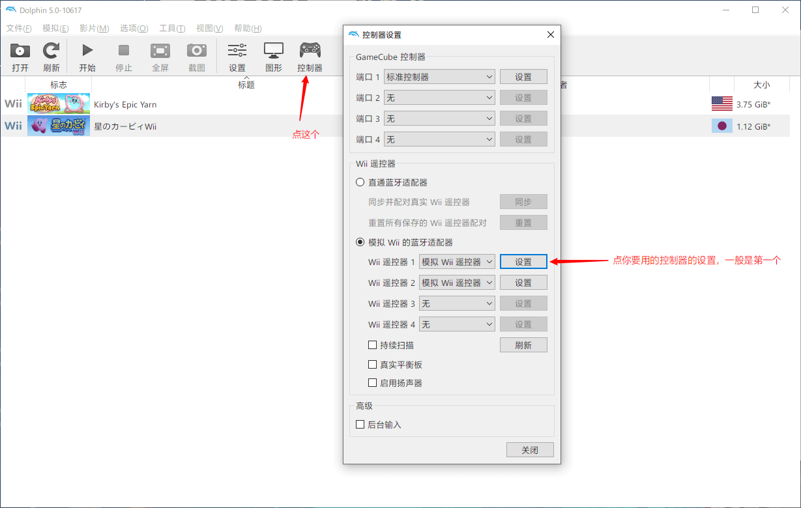

> 开头附上星之卡比系列的 [下载地址](https://eyun.baidu.com/s/3i51Jf17) 还有 Wii 模拟器的 [下载地址](https://cn.dolphin-emu.org/)

## 白屏

有些小伙伴在下好游戏并且在模拟器打开之后会遇到一直卡在白屏的情况，如图

那么这个时候就要注意是不是模拟器语言设置的问题，我们可以在这里看到游戏的语言

那么可以看到这个语言是 `日语`，那我们就要把模拟器改成对应的，看图操作，找到 `设置 -> Wii -> 系统语言`，然后在下拉菜单里找到 `对应语言`，然后点击关闭即可

现在开始游戏就可以正常运行了

## 无法进入

那有时候还会出现无法进入游戏界面的情况，会有类似下面这样的提示

那这个情况只需要去 `控制器 -> Wii 遥控器` 然后点击你要是用的模拟手柄的设置，将 `扩展` 这一项改成无就可以，看图操作

现在再试试进入游戏就正常了

