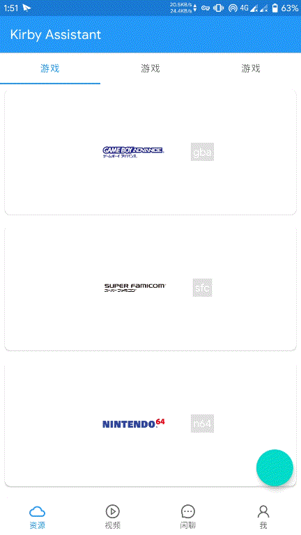

最近在重写 Kirby Assistant 的时候需要实现像图中的效果，那这样的效果具体应该怎么实现呢，快点进来看看吧。(图在里面)

(这里有图，GitHub 可能速度比较慢)


## 准备过程

首先这样的效果都是基 `CoordinatorLayout` 来实现的，所以先在 `app` 模块下添加如下依赖

``` gradle
implementation 'androidx.coordinatorlayout:coordinatorlayout:1.1.0-beta01'//版本可能不是最新，根据自身情况选择新版
```

然后将需要实现这个效果界面的布局最顶层的布局替换为`CoordinatorLayout`即

``` xml
<androidx.coordinatorlayout.widget.CoordinatorLayout
        xmlns:android="http://schemas.android.com/apk/res/android"
        xmlns:app="http://schemas.android.com/apk/res-auto"
        android:layout_width="match_parent"
        android:layout_height="match_parent">

<!--可能会有其他的组件-->

</androidx.coordinatorlayout.widget.CoordinatorLayout>
```

到此，准备过程就完成了

## 实现隐藏 Toolbar

首先在上面的基础上需要添加 Toolbar 组件，如

``` xml
<androidx.coordinatorlayout.widget.CoordinatorLayout
        xmlns:android="http://schemas.android.com/apk/res/android"
        xmlns:app="http://schemas.android.com/apk/res-auto"
        android:layout_width="match_parent"
        android:layout_height="match_parent">

    <com.google.android.material.appbar.AppBarLayout
            android:layout_width="match_parent"
            android:layout_height="wrap_content"
            android:id="@+id/mainAppBarLayout">

        <androidx.appcompat.widget.Toolbar
                android:id="@+id/toolbar"
                android:layout_height="?attr/actionBarSize"
                android:layout_width="match_parent"
                android:background="?attr/colorPrimary"
                android:theme="@style/ThemeOverlay.AppCompat.Dark.ActionBar"
                android:elevation="4dp"
                app:popupTheme="@style/ThemeOverlay.AppCompat.Light"
                app:layout_scrollFlags="scroll|enterAlways|snap">
                <!--上面这行重点-->

        </androidx.appcompat.widget.Toolbar>

    </com.google.android.material.appbar.AppBarLayout>

    <!--可能会有其他的组件-->

</androidx.coordinatorlayout.widget.CoordinatorLayout>
```

那么这里需要说明一下 `app:layout_scrollFlags="scroll|enterAlways|snap"` 是什么意思，这个实际上是用来控制 AppBarLayout 内部组件的行为。  

其中,`scroll` 表示当界面向上滚动的时候, Toolbar会
跟着一起向上滚动并实现隐藏。

`enterAlways` 表示当界面向下滚动的时候, Toolbar会跟着一起向下滚动并重新显示。

`snap` 表示当 Toolbar还没有完全隐藏或显示的时候,会根据当前滚动的距离,自动选择是隐藏还是显示。

当然还有其他参数，但是比较少用

接着添加另外一个组件，例如 RecyclerView

``` xml
<androidx.coordinatorlayout.widget.CoordinatorLayout
        xmlns:android="http://schemas.android.com/apk/res/android"
        xmlns:app="http://schemas.android.com/apk/res-auto"
        android:layout_width="match_parent"
        android:layout_height="match_parent">

    <!--AppBarLayout相关组件-->

    <androidx.recyclerview.widget.RecyclerView
            android:id="@+id/main_rlv"
            android:layout_width="match_parent"
            android:layout_height="match_parent"
            app:layout_behavior="@string/appbar_scrolling_view_behavior"/>
            <!--重点-->

    <!--可能会有其他的组件-->

</androidx.coordinatorlayout.widget.CoordinatorLayout>
```

可以看到这里指定了一个 `app:layout_behavior="@string/appbar_scrolling_view_behavior"` 那么这个属性实际上是谷歌封装好的一个 Behavior，已经完成了 Toolbar 隐藏所有动画效果。

## 实现隐藏 BottomNavigation

BottomNavigation 的话，谷歌没有进行封装，需要我们自己实现，那么先在布局添加 BottomNavigation 组件

``` xml
<androidx.coordinatorlayout.widget.CoordinatorLayout
        xmlns:android="http://schemas.android.com/apk/res/android"
        xmlns:app="http://schemas.android.com/apk/res-auto"
        android:layout_width="match_parent"
        android:layout_height="match_parent">

    <!--AppBarLayout相关组件-->

    <!--RecyclerView组件-->

    <com.google.android.material.bottomnavigation.BottomNavigationView
            android:id="@+id/main_bottom_navigation_bar"
            android:layout_width="match_parent"
            android:layout_height="?attr/actionBarSize"
            android:layout_gravity="bottom"
            android:background="?android:attr/windowBackground"
            android:elevation="8dp"
            app:layout_behavior="cn.endureblaze.kirby.main.BottomNavigationBehavior"
            app:menu="@menu/main_bottom_navigation_menu"
            app:labelVisibilityMode="labeled"/>

</androidx.coordinatorlayout.widget.CoordinatorLayout>
```

那么可以看到这里指定了一个 `app:layout_behavior="cn.endureblaze.kirby.main.BottomNavigationBehavior"`
这实际上是指定了一个自定义 behavior，数值需要填上绝对路径

那么来看看 BottomNavigationBehavior 是怎么写的吧

``` java
public class BottomNavigationBehavior<V extends View>  extends CoordinatorLayout.Behavior<V> {

    private int lastStartedType;
    private ValueAnimator offsetAnimator;
    private boolean isSnappingEnabled = true;

    public BottomNavigationBehavior (Context context, AttributeSet attrs) {
        super(context, attrs);
    }

    public BottomNavigationBehavior () {
        super();
    }

    public void setSnappingEnabled(boolean isEnabled) {
        isSnappingEnabled = isEnabled;
        lastStartedType = 0;
        if (offsetAnimator != null) {
            offsetAnimator.cancel();
            offsetAnimator = null;
        }
    }

    public void expand(CoordinatorLayout coordinatorLayout, V child) {

        int[] consumed = new int[2];

        boolean curIsSnappingEnabled = isSnappingEnabled;
        if(curIsSnappingEnabled) {
            setSnappingEnabled(false);
        }

        onNestedPreScroll(coordinatorLayout, child, null, 0, -1000, consumed, ViewCompat.TYPE_TOUCH);

        if(curIsSnappingEnabled) {
            setSnappingEnabled(true);
        }
    }

    @Override
    public boolean onStartNestedScroll(@NonNull CoordinatorLayout coordinatorLayout, @NonNull V child, @NonNull View directTargetChild,
                                       @NonNull View target, int axes, int type) {

        if (axes != ViewCompat.SCROLL_AXIS_VERTICAL)
            return false;

        lastStartedType = type;
        if(offsetAnimator!= null) {
            offsetAnimator.cancel();
        }

        return true;
    }

    @Override
    public void onStopNestedScroll(@NonNull CoordinatorLayout coordinatorLayout, @NonNull V child, @NonNull View target, int type) {
        if (!isSnappingEnabled)
            return ;

        // 添加一个 snap behaviour
        // 这里的逻辑借用了 AppBarLayout onStopNestedScroll 相关代码

        if (lastStartedType == ViewCompat.TYPE_TOUCH || type == ViewCompat.TYPE_NON_TOUCH) {

            // find nearest seam
            float currTranslation = child.getTranslationY();
            float childHalfHeight = child.getHeight() * 0.5f;

            if (currTranslation >= childHalfHeight) {
                animateBarVisibility(child, false); // 向下
            } else {
                animateBarVisibility(child, true); //向上
            }

        }
    }

    @Override
    public void onNestedPreScroll (@NonNull CoordinatorLayout coordinatorLayout,
                                   @NonNull V child,
                                   View target,
                                   int dx,
                                   int dy,
                                   @NonNull int[] consumed,
                                   int type) {

        super.onNestedPreScroll(coordinatorLayout, child, target, dx, dy, consumed, type);
        child.setTranslationY(Math.max(0f, Math.min(child.getHeight(), child.getTranslationY() + dy)));
    }


    @Override
    public boolean layoutDependsOn(@NonNull CoordinatorLayout parent, @NonNull V child, @NonNull View dependency) {
        if(dependency instanceof Snackbar.SnackbarLayout) {
            updateSnackBar(child, (Snackbar.SnackbarLayout)dependency);
        }

        return super.layoutDependsOn(parent, child, dependency);
    }

    private void updateSnackBar(View child, Snackbar.SnackbarLayout snackBarLayout) {
        if(snackBarLayout.getLayoutParams() instanceof CoordinatorLayout.LayoutParams) {
            CoordinatorLayout.LayoutParams params = (CoordinatorLayout.LayoutParams)snackBarLayout.getLayoutParams();

            params.setAnchorId(child.getId());
            params.anchorGravity = Gravity.TOP;
            params.gravity = Gravity.TOP;
            snackBarLayout.setLayoutParams(params);
        }
    }

    private void animateBarVisibility(final View child, boolean isVisible) {
        if (offsetAnimator == null) {
            offsetAnimator = new ValueAnimator();
            offsetAnimator.setInterpolator(new DecelerateInterpolator());
            offsetAnimator.setDuration(150L);
            offsetAnimator.addUpdateListener(animation -> child.setTranslationY((float)animation.getAnimatedValue()));
        } else {
            offsetAnimator.cancel();
        }

        float targetTranslation = isVisible ? 0f : child.getHeight();
        offsetAnimator.setFloatValues(child.getTranslationY(), targetTranslation);
        offsetAnimator.start();
    }
}
```

那么这个 behavior 不仅实现了 BottomNavigation 的西东隐藏，而且添加了 snap 效果，并且整合了 snackbar 与 BottomNavigation 之间的关系，这样就不会重叠了

snap 效果可以通过`private boolean isSnappingEnabled = true//false是关闭;`来控制

## FloatingActionButton 呢

上面的这些都是忽略了 FAB 的情况下，那么 FAB 应该如何实现呢？当然也是靠自定义 behavior 不过稍稍有点不同，一起来看看吧

首先添加布局

``` xml
<androidx.coordinatorlayout.widget.CoordinatorLayout
        xmlns:android="http://schemas.android.com/apk/res/android"
        xmlns:app="http://schemas.android.com/apk/res-auto"
        android:layout_width="match_parent"
        android:layout_height="match_parent">

    <!--AppBarLayout相关组件-->

    <!--RecyclerView组件-->

    <!--BottomNavigationView组件-->

<com.google.android.material.floatingactionbutton.FloatingActionButton
            android:id="@+id/fab_main"
            android:layout_width="wrap_content"
            android:layout_height="wrap_content"
            android:layout_gravity="top"
            app:layout_anchor="@id/main_bottom_navigation_bar"
            app:layout_anchorGravity="top|end"
            app:useCompatPadding="true"
            app:layout_behavior="cn.endureblaze.kirby.main.BottomNavigationFABBehavior"
            app:fabSize="normal"
            app:layout_scrollFlags="scroll|enterAlways"/>

</androidx.coordinatorlayout.widget.CoordinatorLayout>
```

这里有几个属性需要注意一下

``` xml
   app:layout_anchor="@id/main_bottom_navigation_bar"
   app:layout_anchorGravity="top|end"
   app:layout_behavior="cn.endureblaze.kirby.main.BottomNavigationFABBehavior"
```

`layout_anchor` 是用来指定一个 FAB 的锚点，即以哪个控件为参照点设置位置  
`layout_anchorGravity` 设置 FAB 相对锚点的位置，值有 bottom、center、right、left、top等
`layout_behavior` 依然是设置自定义 behavior，不再赘述

现在看看 BottomNavigationFABBehavior 有什么内容吧

``` java
public class BottomNavigationFABBehavior<V extends View>  extends CoordinatorLayout.Behavior<V> {

    public BottomNavigationFABBehavior (Context context, AttributeSet attrs) {
        super(context, attrs);
    }

    public BottomNavigationFABBehavior () {
        super();
    }
    @Override
    public void onDependentViewRemoved(@NonNull CoordinatorLayout parent, @NonNull V child, @NonNull View dependency) {
        child.setTranslationY(0f);
    }

    @Override
    public boolean onDependentViewChanged(@NonNull CoordinatorLayout parent, @NonNull V child, @NonNull View dependency) {
        return updateButton(child, dependency);
    }

    @Override
    public boolean layoutDependsOn(@NonNull CoordinatorLayout parent, @NonNull V child, @NonNull View dependency) {
        return dependency instanceof Snackbar.SnackbarLayout;
    }

    private void updateSnackBar(View child, Snackbar.SnackbarLayout snackBarLayout) {
        if(snackBarLayout.getLayoutParams() instanceof CoordinatorLayout.LayoutParams) {
            CoordinatorLayout.LayoutParams params = (CoordinatorLayout.LayoutParams)snackBarLayout.getLayoutParams();

            params.setAnchorId(child.getId());
            params.anchorGravity = Gravity.TOP;
            params.gravity = Gravity.TOP;
            snackBarLayout.setLayoutParams(params);
        }
    }

    private boolean updateButton(View child,View dependency){
        if(dependency instanceof Snackbar.SnackbarLayout){
            float oldTranslation = child.getTranslationY();
            float height = dependency.getHeight();
            float newTranslation = dependency.getTranslationY() - height;
            child.setTranslationY(newTranslation);
            return oldTranslation != newTranslation;
        }
        return false;
    }

}
```

可以看到还是比较简单的，主要是实现了与底栏的交互还有 snackbar 的交互

## 结尾

那这个实现是我参考了其他的博文以及 GitHub 的一些项目总结出来的，如果那里有问题还请指
