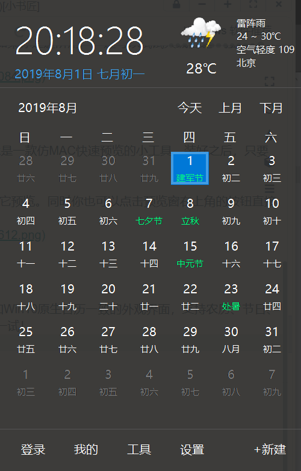

这些软件都是我自己用过的，可以通过左边页面快速定位

## Visual Studio Code

这个简直首推，编辑利器，人生苦短，我用 VS Code 完成关于文本编辑工作的一切。它天生支持几乎所有编程语言，还可以通过扩展个性化相应的语法高亮等。
如果你想忙里偷闲，VS Code 强大的扩展能力还能让你用它刷 LeetCode 或 V2EX，可谓带薪划水必备。

你可以在[官网](https://code.visualstudio.com/)免费获取 Visual Studio Code。

## 福昕 PDF 阅读器

国产，中文界面，流畅好用，界面美观
[点这里](https://www.foxitsoftware.cn/)

## 福昕 PDF 编辑器

福昕（Foxit）可能是我国最受欢迎的 PDF 阅读器，由其出品的 [PDF 编辑器](https://www.foxitsoftware.cn/pdf-editor/) 也是 Adobe Acrobat 的有力竞争对手。它提供了各种 PDF 批注工具；支持编辑 PDF 中的文本、段落、图片；设计并填写表单；OCR 识别图片中的文字；管理 PDF 页面；转换为其它文件格式等，界面也比较友好。

## 火绒安全软件

如果你觉得 Windows Defender 还是有些简陋，火绒安全软件是个不错的选择。它提供了病毒联网查杀、垃圾清理、下载保护、浏览器保护等国产卫士标配功能，但不会拖家带口向你问好，还你一片清净。

除了系统防护外，火绒安全软件还提供了数种实用工具，如弹窗拦截、右键菜单管理、启动项管理、文件粉碎机等。如果你是进阶用户，还可以试试火绒剑这一强大的专业安全分析工具。

你可以在 [官网](https://www.huorong.cn/) 免费获取火绒安全软件。

## Quicklook，仿 MAC 快速预览

MAC 的快速预览很多人都见过，回望 Win10 的「预览」，依旧被抠抠唆唆地安排在窗口右侧，一点也不大气！QuickLook 是一款仿 MAC 快速预览的小工具，装好之后，只要选中文件，按下键盘上的空格键，即可预览文件内容。

QuickLook 支持文本、视频、音频、图片、压缩包、Office 文档……，换句话说，你电脑上任何一款文件几乎都可以用它预览。同时你也可以点击预览窗右上角的按钮直接启动对应程序，非常方便。

[QuickLook：点此下载](http://dl.pconline.com.cn/download/1115319.html)

## 升级 Win10 日历！优效日历

Win10 为右下角托盘设计了一个新日历，但依旧被吐槽功能太弱，优效日历是 Win10 原生日历的最佳替代者。它有着和 Win10 原生日历一致的外观界面，支持农历、节日、调休显示，支持日程提醒、万年历、自定义时钟。同时它还集成了定时关机、屏幕截图两大功能，没用过的一定得试一试！

[点击下载](http://www.youxiao.cn/)

## Chocolatey

Chocolatey 是 Windows 下的包管理器，访问[官网](https://chocolatey.org/)来查看使用方法

## uTools

uTools 是一个极简的桌面管理软件，但它的功能更全面。包含：快速启动、自动识别、数据同步等功能。

比如快速启动，这个功能和 Listary、Everything 等都非常相似。但 uTools 对中文的支持非常有好，还可以首字母检索。

除此外还有插件中心，里面还有各种比如：网页快开、在线翻译、计算器、压缩图片、图片转文字等功能。这也是其它快速启动软件所不具备的。

[点击下载](https://u.tools/)

## 万彩办公大师

万彩办公大师可以说是一个办公必备的工具，包含了各种功能：PDF 编辑、格式转换、图片编辑等，功能多达 60+。

最让人惊喜的是，万彩办公大师使用完全免费，所有的工具无需安装，直接加载就可以启动了。

[下载地址](wofficebox.com/)

## TreeSize

TreeSize 是一个扫描磁盘可视化排列大小的应用，有免费版和专业版可以选

[点击这里](https://www.jam-software.com/treesize_free/)获取免费版

## CCleaner

CCleaner，不仅是常用的垃圾和缓存清理，我也用它在电脑刚到手时卸载掉 Win10 自带的各种无用软件（有些 Windows 不让卸载的自带 UWP，在 CCleaner 里可以卸载掉），甚至我嫌 OneDrive 麻烦，也用它卸载过。界面很友好。批量卸载比手动卸载方便不少。软件是有中文的，但默认是英文，自己手动在 `options-setting-language` 选择 `Chinese simplified` 即可

[点击下载](https://www.ccleaner.com/ccleaner/download)

## BandiZip

BandiZip，界面美观，功能强大，而且免费无广告，另外 [7-Zip](https://www.7-zip.org/)，界面丑了一些，功能还是很强的。也有不少人推荐修改版的 rar 烈火或者好压，其实都不错。

[下载地址](http://www.bandisoft.com/bandizip/cn/)

## Obs-Open Broadcaster Software

OBS，不用多说了，剪视频、录游戏好帮手。
[下载地址](https://obsproject.com/)

## VLC media player

跨平台的播放器，Linux 的时候一直用的，Windows 也就接着用了，有浏览器插件，可以直接把浏览器的视频推过来播放

[点这里下载](https://www.videolan.org/)

## Geek Uninstaller

Geek Uninstaller 是一个专业卸载软件，采取深而快的扫描方式，删除所有无用的文件，注册表，卸载无残留！
这款软件也是一款单文件软件，下载后，不用安装，双击直接使用，卸载软件、强制彻底清除软件残留垃圾文件或是查看某软件的注册表项目等等。

你可以在他的[官网](https://geekuninstaller.com/)获取到

## 未完

后面想到了再补充
